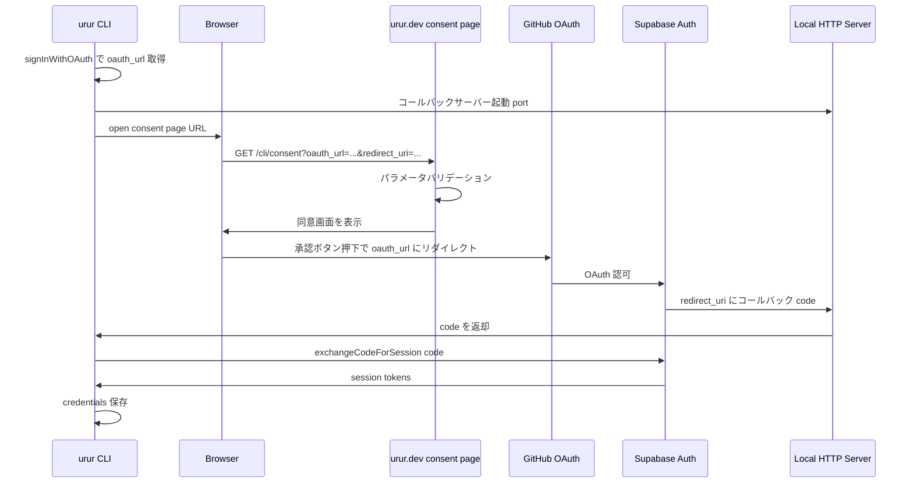

# 設計ドキュメント: cli-consent-page

## Overview

**Purpose**: CLI ログイン時にブラウザで同意確認画面を表示し、ユーザーが明示的に承認してから GitHub OAuth フローに進む機能を提供する。

**Users**: `urur login` を実行する CLI ユーザーがブラウザ上で確認画面を見る。

**Impact**: 既存の OAuth フローに同意ページを挿入する。CLI は直接 OAuth URL を開く代わりに、urur.dev の同意ページ URL を開く。PKCE フローは CLI 側で完結し、同意ページはリダイレクトのみを担当する。

### Goals
- CLI ログイン時にブラウザで同意確認画面を表示する
- オープンリダイレクト攻撃を防止するバリデーションを実装する
- 既存の PKCE 認証フローを維持する
- 開発環境と本番環境で同意ページの URL を切り替え可能にする

### Non-Goals
- 同意ページでの Supabase OAuth 呼び出し（リダイレクトのみ）
- Web 側の認証状態管理
- ログイン後のリダイレクト先カスタマイズ

## Architecture

### Existing Architecture Analysis

- **CLI 側**: `login.ts` が `signInWithOAuth()` で OAuth URL を取得し、`open()` でブラウザを開く。ローカル HTTP サーバーでコールバックを待ち受ける
- **Web 側**: HonoX のファイルベースルーティング。`login.tsx` が `createRoute` で作成されている
- **ビルド時定数**: `tsup.config.ts` の `define` で `__SUPABASE_URL__`, `__SUPABASE_ANON_KEY__` を埋め込み、`config.ts` で `declare const` → export するパターンが確立

### Architecture Pattern & Boundary Map



**Architecture Integration**:
- **Selected pattern**: 同意ページはステートレスなリダイレクトゲートウェイ。OAuth ロジックは持たない
- **Domain boundaries**: Web 同意ページはバリデーション + UI 表示 + リダイレクトのみ。認証ロジックは CLI 側に完結
- **Existing patterns preserved**: HonoX `createRoute` パターン、tsup `define` パターン、login.tsx デザインパターン
- **New components rationale**: バリデーション関数を独立モジュールにすることでテスタビリティを確保

### Technology Stack

| Layer | Choice / Version | Role in Feature | Notes |
|-------|------------------|-----------------|-------|
| CLI | TypeScript + tsup | `WEB_URL` ビルド時定数、`login.ts` 変更 | 既存パターン踏襲 |
| Web Frontend | HonoX + JSX | 同意ページルート (`routes/cli/consent.tsx`) | `createRoute` パターン |
| Web Styling | Tailwind CSS v4 | login.tsx と同一のデザインシステム | ink/paper カラー |
| Validation | TypeScript pure functions | URL バリデーション | 外部依存なし |

## Requirements Traceability

| Requirement | Summary | Components | Interfaces | Flows |
|-------------|---------|------------|------------|-------|
| 1.1 | CLI が同意ページ URL をブラウザで開く | ConsentUrlBuilder, login.ts | — | OAuth フロー |
| 1.2 | 確認メッセージを表示 | ConsentPage | — | — |
| 1.3 | 承認/キャンセルボタンを表示 | ConsentPage | — | — |
| 1.4 | 承認ボタンで OAuth URL にリダイレクト | ConsentPage | — | OAuth フロー |
| 1.5 | キャンセルボタンでウィンドウを閉じる | ConsentPage | — | — |
| 2.1 | OAuth URL をクエリパラメータで渡す | ConsentUrlBuilder | — | OAuth フロー |
| 2.2 | 同意ページは signInWithOAuth を呼ばない | ConsentPage | — | — |
| 2.3 | PKCE の code_verifier をインメモリ保持 | (既存 login.ts、変更なし) | — | OAuth フロー |
| 3.1 | redirect_uri は localhost/127.0.0.1 のみ | CliConsentValidation | isValidRedirectUri | — |
| 3.2 | oauth_url は Supabase ホスト名一致のみ | CliConsentValidation | isValidOAuthUrl | — |
| 3.3 | redirect_uri 不正時にエラー表示 | ConsentPage | — | — |
| 3.4 | oauth_url 不正時にエラー表示 | ConsentPage | — | — |
| 3.5 | パラメータ欠落時にエラー表示 | ConsentPage | — | — |
| 4.1 | login.tsx と同じデザインシステム | ConsentPage | — | — |
| 4.2 | Supabase CDN 不要 | ConsentPage | — | — |
| 5.1 | WEB_URL ビルド時定数 | WebUrlConfig | — | — |
| 5.2 | デフォルト値 https://urur.dev | WebUrlConfig | — | — |
| 5.3 | .env で上書き可能 | WebUrlConfig | — | — |

## Components and Interfaces

| Component | Domain/Layer | Intent | Req Coverage | Key Dependencies | Contracts |
|-----------|-------------|--------|--------------|------------------|-----------|
| CliConsentValidation | Web / Lib | URL バリデーション | 3.1, 3.2 | なし | Service |
| ConsentPage | Web / Route | 同意ページ UI + ルーティング | 1.2–1.5, 2.2, 3.3–3.5, 4.1–4.2 | CliConsentValidation (P0) | — |
| WebUrlConfig | CLI / Config | WEB_URL ビルド時定数管理 | 5.1–5.3 | tsup define (P0) | — |
| ConsentUrlBuilder | CLI / Command | 同意ページ URL 構築 | 1.1, 2.1 | WebUrlConfig (P0) | — |

### Web / Lib

#### CliConsentValidation

| Field | Detail |
|-------|--------|
| Intent | 同意ページに渡されるクエリパラメータのセキュリティバリデーション |
| Requirements | 3.1, 3.2 |

**Responsibilities & Constraints**
- `redirect_uri` が `http://127.0.0.1:*` または `http://localhost:*` であることを検証する
- `oauth_url` のホスト名が指定された Supabase URL のホスト名と一致することを検証する
- 純粋関数として実装し、外部依存を持たない

**Dependencies**
- なし（pure functions）

**Contracts**: Service [x]

##### Service Interface
```typescript
/**
 * redirect_uri が許可されたローカルホストアドレスかを検証する。
 * 許可: http://127.0.0.1:{port}/* または http://localhost:{port}/*
 */
function isValidRedirectUri(uri: string): boolean

/**
 * oauth_url のホスト名が supabaseUrl のホスト名と一致するかを検証する。
 */
function isValidOAuthUrl(oauthUrl: string, supabaseUrl: string): boolean
```
- Preconditions: 引数は string 型
- Postconditions: boolean を返す。不正な URL フォーマットの場合は false
- Invariants: URL パース失敗時は false（例外を投げない）

**Implementation Notes**
- `new URL()` で URL をパースし、hostname を比較する
- パース失敗時は `try/catch` で false を返す

### Web / Route

#### ConsentPage

| Field | Detail |
|-------|--------|
| Intent | CLI ログイン同意画面の表示とリダイレクト処理 |
| Requirements | 1.2–1.5, 2.2, 3.3–3.5, 4.1–4.2 |

**Responsibilities & Constraints**
- HonoX `createRoute` でルート定義（`web/app/routes/cli/consent.tsx`）
- サーバー側でクエリパラメータ `oauth_url` と `redirect_uri` をバリデーション
- バリデーション成功時: 同意 UI を表示（承認ボタン + キャンセルボタン）
- バリデーション失敗時: エラーメッセージを表示
- 承認ボタン: クライアント側で `window.location.href = oauth_url` を実行
- キャンセルボタン: `window.close()` を実行
- Supabase クライアントライブラリや CDN を読み込まない

**Dependencies**
- Inbound: CLI が同意ページ URL をブラウザで開く (P0)
- Outbound: CliConsentValidation — パラメータ検証 (P0)
- External: `c.env.SUPABASE_URL` — バリデーション用ホスト名取得 (P0)

**Contracts**: なし（サーバーレンダリングのみ）

**Implementation Notes**
- login.tsx と同じ中央カードレイアウト、Space Mono ロゴ、ink/paper カラーを使用
- 承認ボタンのリダイレクトは `<script>` タグ内のインラインイベントハンドラで実装（HonoX SSR パターン準拠）
- oauth_url はサーバー側でバリデーション済みの値のみクライアントに渡す
- **XSS 防止**: oauth_url をクライアントに渡す際は、承認ボタンの `data-oauth-url` 属性に設定する。インラインスクリプトは `dataset.oauthUrl` で属性値を読み取り `window.location.href` に代入する。JSX の属性値は HonoX が自動エスケープするため、スクリプトインジェクションを防止できる

### CLI / Config

#### WebUrlConfig

| Field | Detail |
|-------|--------|
| Intent | WEB_URL ビルド時定数の宣言と export |
| Requirements | 5.1–5.3 |

**Responsibilities & Constraints**
- `config.ts` に `declare const __WEB_URL__: string` と `export const WEB_URL` を追加
- `tsup.config.ts` の `define` に `__WEB_URL__` を追加（デフォルト: `https://urur.dev`）
- `vitest.config.ts` の `define` に `__WEB_URL__` を追加（テスト用: `http://localhost:5173`）
- `.env` と `.env.example` に `WEB_URL` エントリを追加

**Dependencies**
- Outbound: tsup define 機構 (P0)

**Contracts**: なし（ビルド時定数）

**Implementation Notes**
- 既存の `SUPABASE_URL` / `SUPABASE_ANON_KEY` と完全に同一のパターンを踏襲する

### CLI / Command

#### ConsentUrlBuilder

| Field | Detail |
|-------|--------|
| Intent | 同意ページの完全な URL を構築する |
| Requirements | 1.1, 2.1 |

**Responsibilities & Constraints**
- `login.ts` 内で同意ページ URL を構築する（独立モジュール不要）
- `WEB_URL` + `/cli/consent` + `?oauth_url=<encoded>&redirect_uri=<encoded>` の形式
- `oauth_url` と `redirect_uri` は `encodeURIComponent` でエンコードする

**Dependencies**
- Inbound: WebUrlConfig — `WEB_URL` 定数 (P0)
- Inbound: Supabase `signInWithOAuth` — OAuth URL (P0)

**Contracts**: なし（login.ts 内のインラインロジック）

**Implementation Notes**
- `login.ts` の `open(oauthData.url)` を `open(consentUrl)` に変更
- `consentUrl` の構築は login.ts 内で完結（数行のため独立関数化は不要）

## Error Handling

### Error Categories and Responses

| エラー種別 | 条件 | レスポンス |
|-----------|------|----------|
| パラメータ欠落 | `oauth_url` または `redirect_uri` が未指定 | エラーメッセージ「必要なパラメータが不足しています」を表示 |
| redirect_uri 不正 | localhost/127.0.0.1 以外 | エラーメッセージ「不正なリダイレクト先です」を表示 |
| oauth_url 不正 | Supabase ホスト名不一致 | エラーメッセージ「不正な認証 URL です」を表示 |

すべてのエラーケースでリダイレクトは行わず、同意ページ上にエラーメッセージのみを表示する。

## Testing Strategy

### Unit Tests
- `isValidRedirectUri`: 正常系（127.0.0.1、localhost、各種ポート）、異常系（外部 URL、https、パス無し）
- `isValidOAuthUrl`: 正常系（ホスト名一致）、異常系（ホスト名不一致、不正 URL）

### Integration Tests
- `login.ts`: `open()` の引数が同意ページ URL であることを検証
- `login.ts`: カスタムポート指定時の `redirect_uri` パラメータ検証
- `login.ts`: `WEB_URL` が同意ページ URL のベースとして使用されることを検証

## Security Considerations

- **オープンリダイレクト防止**: `redirect_uri` は `http://127.0.0.1:*` / `http://localhost:*` のみ許可
- **OAuth URL 検証**: `oauth_url` は Supabase のホスト名と一致する場合のみ許可
- **サーバーサイドバリデーション**: パラメータ検証はサーバー側で実行し、バリデーション済みの値のみクライアントに渡す
- **PKCE 維持**: code_verifier は CLI のインメモリに保持され、同意ページ経由では漏洩しない
