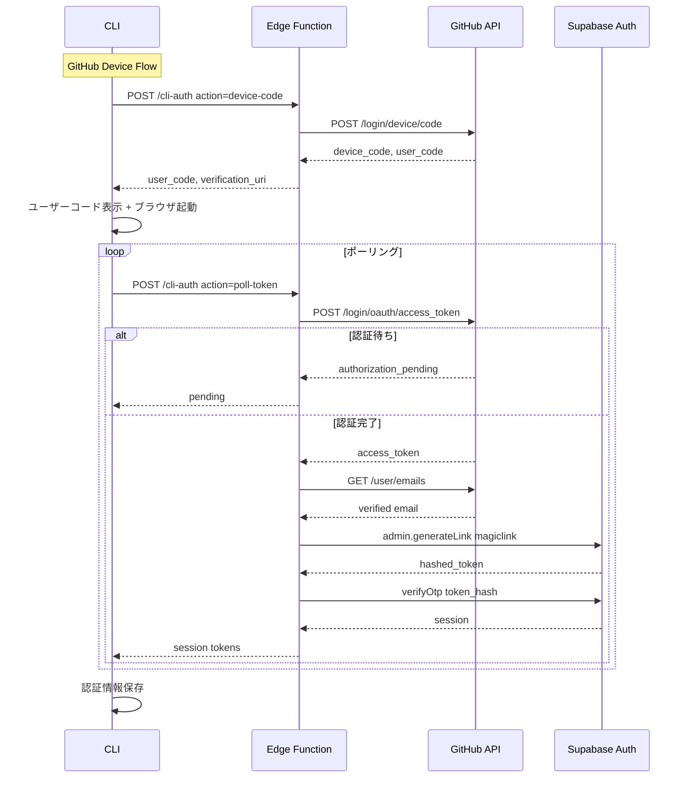
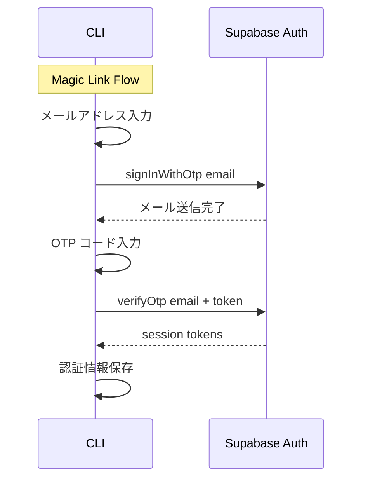

# Design Document: Device Flow Login

## Overview

**Purpose**: CLI のログイン方式をローカルサーバー + PKCE フローから GitHub Device Flow + Magic Link（メール OTP）に移行する。ローカルサーバーの起動を廃止し、ポート衝突の問題を解消する。

**Users**: CLI ユーザー（個人開発者）がターミナルから GitHub アカウントまたはメールアドレスで認証する。

**Impact**: 既存の login コマンド、oauthServer、Web 側の consent ページを置き換え。Supabase Edge Function を新規追加。

### Goals
- ローカル HTTP サーバーを不要にし、ポート衝突を解消
- GitHub Device Flow でブラウザレスな認証を実現
- Magic Link でメールのみでの認証を提供
- Edge Function でサーバーサイドのセッション生成を安全に行う

### Non-Goals
- Web 側の Google OAuth 削除（別スコープ）
- トークンリフレッシュの自動化
- 複数プロバイダーの同時リンク UI

## Architecture

### Existing Architecture Analysis

現在のログインフロー:
1. CLI → `supabase.auth.signInWithOAuth()` で OAuth URL 取得
2. CLI → ローカル HTTP サーバー起動（127.0.0.1:8976）
3. ブラウザ → Web consent ページ → GitHub OAuth → Supabase → ローカルサーバーにリダイレクト
4. CLI → `exchangeCodeForSession()` でセッション取得

廃止対象: `src/lib/oauthServer.ts`, `--port` オプション, Web consent ページ依存

### Architecture Pattern & Boundary Map





**Architecture Integration**:
- Selected pattern: Edge Function プロキシ。GitHub API 呼び出しと admin 操作をサーバーサイドに集約
- Domain boundaries: CLI（UI / ポーリング制御）、Edge Function（GitHub API 仲介 / セッション生成）、Supabase Auth（認証基盤）
- Existing patterns preserved: `loadCredentials` / `saveCredentials` / `clearCredentials` の認証情報管理
- New components: Edge Function `cli-auth`、CLI 側の `deviceFlow.ts` と `magicLink.ts`
- Steering compliance: TypeScript strict, `process.exitCode` パターン, TDD

### Technology Stack

| Layer | Choice / Version | Role in Feature | Notes |
|-------|------------------|-----------------|-------|
| CLI | TypeScript + Commander.js | ログインコマンド、ポーリング、UI | 既存 |
| Edge Function | Deno v2 + Supabase Edge Runtime | GitHub API プロキシ、セッション生成 | 新規 |
| Auth | Supabase Auth + @supabase/supabase-js v2 | セッション管理、Magic Link | 既存 |
| External API | GitHub OAuth Device Flow | GitHub 認証 | 新規依存 |

## System Flows

上記 Architecture セクションのシーケンス図を参照。

**Key Decisions**:
- CLI がポーリングを制御し、Edge Function はステートレスに保つ（タイムアウト制約回避）
- Magic Link は Edge Function を経由せず、CLI から Supabase に直接アクセス
- ポーリング間隔は GitHub API の `interval` レスポンスに従い、`slow_down` エラー時に +5s

## Requirements Traceability

| Requirement | Summary | Components | Interfaces | Flows |
|-------------|---------|------------|------------|-------|
| 1.1 | ログイン方法選択表示 | LoginCommand | select prompt | - |
| 1.2 | 選択に応じたフロー開始 | LoginCommand | loginWithGitHub / loginWithEmail | - |
| 1.3 | 再ログイン確認 | LoginCommand | confirm prompt | - |
| 2.1 | ユーザーコード表示 | LoginCommand, DeviceFlow | EdgeFunctionAPI.requestDeviceCode | Device Flow seq |
| 2.2 | ブラウザ自動オープン | LoginCommand | open() | Device Flow seq |
| 2.3 | スピナー付きポーリング | LoginCommand, DeviceFlow | EdgeFunctionAPI.pollToken | Device Flow seq |
| 2.4 | セッション取得・保存 | LoginCommand, DeviceFlow | saveCredentials | Device Flow seq |
| 2.5 | ユーザー名表示 | LoginCommand | - | - |
| 3.1 | メールアドレス入力 | LoginCommand, MagicLink | input prompt | Magic Link seq |
| 3.2 | Magic Link メール送信 | MagicLink | supabase.auth.signInWithOtp | Magic Link seq |
| 3.3 | OTP コード入力 | LoginCommand, MagicLink | input prompt | Magic Link seq |
| 3.4 | OTP 検証・セッション保存 | MagicLink | supabase.auth.verifyOtp | Magic Link seq |
| 3.5 | 無効メール再入力 | LoginCommand | validation | - |
| 3.6 | 無効 OTP 再入力 | LoginCommand | validation | - |
| 4.1 | デバイスコード要求 | CliAuthFunction | GitHub API | Device Flow seq |
| 4.2 | ポーリング・セッション生成 | CliAuthFunction | GitHub API, Supabase Admin | Device Flow seq |
| 4.3 | verified メール取得 | CliAuthFunction | GitHub API /user/emails | Device Flow seq |
| 4.4 | generateLink + verifyOtp | CliAuthFunction | Supabase Admin API | Device Flow seq |
| 4.5 | authorization_pending 返却 | CliAuthFunction | - | Device Flow seq |
| 4.6 | expired_token エラー | CliAuthFunction | - | Device Flow seq |
| 4.7 | SERVICE_ROLE_KEY 保護 | CliAuthFunction | env vars | - |
| 5.1 | 15分タイムアウト | DeviceFlow | expires_in | - |
| 5.2 | ネットワークエラー | LoginCommand | try/catch | - |
| 5.3 | Edge Function エラー | LoginCommand | process.exitCode | - |
| 5.4 | OTP リトライ・再送提案 | MagicLink | retry logic | - |
| 5.5 | process.exitCode パターン | LoginCommand | - | - |
| 6.1 | oauthServer 削除 | - | - | - |
| 6.2 | --port オプション削除 | LoginCommand | - | - |
| 6.3 | consent ページ依存削除 | LoginCommand | - | - |

## Components and Interfaces

| Component | Domain | Intent | Req Coverage | Key Dependencies | Contracts |
|-----------|--------|--------|--------------|------------------|-----------|
| LoginCommand | CLI / Commands | ログイン方法選択と認証フロー統括 | 1.1-1.3, 2.1-2.5, 3.1, 3.3, 3.5-3.6, 5.1-5.5, 6.1-6.3 | DeviceFlow (P0), MagicLink (P0) | Service |
| DeviceFlow | CLI / Lib | GitHub Device Flow のポーリング制御 | 2.1-2.5, 5.1 | EdgeFunctionAPI (P0), auth (P0) | Service |
| MagicLink | CLI / Lib | メール OTP 認証フロー | 3.1-3.6, 5.4 | supabase (P0), auth (P0) | Service |
| EdgeFunctionAPI | CLI / Lib | Edge Function への HTTP 通信 | 4.1-4.2 | fetch (P0) | Service, API |
| CliAuthFunction | Edge Function | GitHub API プロキシ + Supabase セッション生成 | 4.1-4.7 | GitHub API (P0), Supabase Admin (P0) | API |

### CLI / Commands

#### LoginCommand

| Field | Detail |
|-------|--------|
| Intent | ログイン方法の選択と認証フロー統括 |
| Requirements | 1.1-1.3, 2.1-2.5, 3.1, 3.3, 3.5-3.6, 5.1-5.5, 6.1-6.3 |

**Responsibilities & Constraints**
- ログイン方法の選択 UI（GitHub / メール）
- 既存ログイン状態の確認と再ログイン確認
- 各認証フローへの委譲
- エラーハンドリングと `process.exitCode` 設定

**Dependencies**
- Outbound: DeviceFlow — GitHub 認証 (P0)
- Outbound: MagicLink — メール認証 (P0)
- Outbound: auth.ts — 認証情報の読み書き (P0)
- External: @inquirer/prompts — 選択 UI (P0)
- External: open — ブラウザ起動 (P1)
- External: ora — スピナー (P1)

**Contracts**: Service [x]

##### Service Interface
```typescript
interface LoginOptions {
  // --port オプションは廃止
}

// src/commands/login.ts
function login(options: LoginOptions): Promise<void>
```

### CLI / Lib

#### DeviceFlow

| Field | Detail |
|-------|--------|
| Intent | GitHub Device Flow のポーリング制御とセッション取得 |
| Requirements | 2.1-2.5, 5.1 |

**Responsibilities & Constraints**
- Edge Function 経由でデバイスコード取得
- ポーリング間隔の管理（interval + slow_down 対応）
- expires_in に基づくタイムアウト制御
- セッションの取得と返却

**Dependencies**
- Outbound: EdgeFunctionAPI — Edge Function 通信 (P0)

**Contracts**: Service [x]

##### Service Interface
```typescript
interface DeviceCodeResponse {
  userCode: string
  verificationUri: string
  expiresIn: number
  interval: number
  deviceCode: string
}

interface DeviceFlowSession {
  accessToken: string
  refreshToken: string
  expiresAt: number
  userName: string
}

interface DeviceFlowService {
  requestDeviceCode(): Promise<DeviceCodeResponse>
  pollForSession(deviceCode: string, interval: number, expiresIn: number): Promise<DeviceFlowSession>
}
```
- Preconditions: Edge Function がデプロイ済み
- Postconditions: 成功時に Supabase セッションを返す
- Invariants: ポーリング間隔は GitHub API の `interval` 以上

#### MagicLink

| Field | Detail |
|-------|--------|
| Intent | メールアドレスによる OTP 認証 |
| Requirements | 3.1-3.6, 5.4 |

**Responsibilities & Constraints**
- Supabase signInWithOtp でメール送信
- OTP 入力の検証
- リトライ制御（最大3回失敗で再送提案）

**Dependencies**
- Outbound: supabase — Supabase クライアント (P0)

**Contracts**: Service [x]

##### Service Interface
```typescript
interface MagicLinkSession {
  accessToken: string
  refreshToken: string
  expiresAt: number
  email: string
}

interface MagicLinkService {
  sendOtp(email: string): Promise<void>
  verifyOtp(email: string, token: string): Promise<MagicLinkSession>
}
```
- Preconditions: 有効なメールアドレス
- Postconditions: 成功時に Supabase セッションを返す

#### EdgeFunctionAPI

| Field | Detail |
|-------|--------|
| Intent | Edge Function への HTTP 通信抽象化 |
| Requirements | 4.1-4.2 |

**Responsibilities & Constraints**
- Edge Function URL の構築（`SUPABASE_URL/functions/v1/cli-auth`）
- リクエスト/レスポンスの型安全な通信
- HTTP エラーのハンドリング

**Dependencies**
- External: fetch (Node.js built-in) (P0)

**Contracts**: Service [x] / API [x]

##### Service Interface
```typescript
interface EdgeFunctionAPI {
  requestDeviceCode(): Promise<DeviceCodeResponse>
  pollToken(deviceCode: string): Promise<PollTokenResponse>
}

type PollTokenResponse =
  | { status: 'pending' }
  | { status: 'expired' }
  | { status: 'success'; session: DeviceFlowSession }
  | { status: 'error'; message: string }
```

##### API Contract
| Method | Endpoint | Request | Response | Errors |
|--------|----------|---------|----------|--------|
| POST | /functions/v1/cli-auth | `{ action: 'device-code' }` | `{ userCode, verificationUri, expiresIn, interval, deviceCode }` | 500 |
| POST | /functions/v1/cli-auth | `{ action: 'poll-token', deviceCode }` | `PollTokenResponse` | 500 |

### Edge Function

#### CliAuthFunction

| Field | Detail |
|-------|--------|
| Intent | GitHub Device Flow プロキシ + Supabase セッション生成 |
| Requirements | 4.1-4.7 |

**Responsibilities & Constraints**
- GitHub API との通信（デバイスコード要求、トークンポーリング）
- GitHub ユーザーの verified メール取得
- `admin.generateLink` + `verifyOtp` でセッション生成
- `SUPABASE_SERVICE_ROLE_KEY` のサーバーサイド限定使用
- `GITHUB_CLIENT_ID` の環境変数管理

**Dependencies**
- External: GitHub API — Device Flow endpoints (P0)
- External: Supabase Admin API — generateLink, verifyOtp (P0)

**Contracts**: API [x]

##### API Contract

**POST /functions/v1/cli-auth**

action: `device-code`
```typescript
// Request
{ action: 'device-code' }

// Response 200
{
  userCode: string      // "WDJB-MJHT"
  verificationUri: string  // "https://github.com/login/device"
  expiresIn: number     // 900
  interval: number      // 5
  deviceCode: string    // encrypted or opaque token
}
```

action: `poll-token`
```typescript
// Request
{ action: 'poll-token', deviceCode: string }

// Response 200 - 認証待ち
{ status: 'pending' }

// Response 200 - 期限切れ
{ status: 'expired' }

// Response 200 - 成功
{
  status: 'success',
  session: {
    accessToken: string,
    refreshToken: string,
    expiresAt: number,
    userName: string
  }
}

// Response 200 - エラー
{ status: 'error', message: string }
```

**Implementation Notes**
- GitHub API 呼び出し時に `Accept: application/json` ヘッダー必須
- `GITHUB_CLIENT_ID` は Edge Function の環境変数として設定
- GitHub `/user/emails` API で `verified: true` かつ `primary: true` のメールを使用
- `generateLink({ type: 'magiclink', email })` でユーザー自動作成 + hashed_token 取得
- `verifyOtp({ token_hash, type: 'email' })` でセッション生成

## Error Handling

### Error Strategy
- CLI 側: `process.exitCode = 1` + `pc.red()` メッセージ。`process.exit()` は使用しない
- Edge Function 側: HTTP 200 + ステータスフィールドでエラーを伝達（`status: 'error'`）

### Error Categories and Responses

**Device Flow エラー**:
| エラー | 発生元 | CLI の対応 |
|--------|--------|-----------|
| `authorization_pending` | GitHub API | ポーリング継続 |
| `slow_down` | GitHub API | interval を +5s して継続 |
| `expired_token` | GitHub API | タイムアウトメッセージ表示 |
| `access_denied` | GitHub API | ユーザーキャンセルメッセージ表示 |
| ネットワークエラー | fetch | 接続確認メッセージ表示 |
| Edge Function エラー | Edge Function | エラー内容表示 |

**Magic Link エラー**:
| エラー | 発生元 | CLI の対応 |
|--------|--------|-----------|
| 無効メール | バリデーション | エラー表示 + 再入力 |
| OTP 不正 | Supabase Auth | エラー表示 + 再入力（最大3回） |
| OTP 3回失敗 | CLI | メール再送を提案 |
| メール送信エラー | Supabase Auth | エラー表示 |

## Testing Strategy

### Unit Tests
- **DeviceFlow**: ポーリング間隔制御、タイムアウト、slow_down 対応
- **MagicLink**: OTP 送信・検証、リトライ制御
- **EdgeFunctionAPI**: リクエスト構築、レスポンスパース、エラーハンドリング
- **LoginCommand**: 方法選択、既存ログイン確認、各フローへの委譲

### Integration Tests
- **Edge Function**: device-code アクション、poll-token アクション（モック GitHub API）
- **LoginCommand**: GitHub フロー全体、Magic Link フロー全体（モック依存）

### E2E Tests
- `urur login` → GitHub 選択 → デバイスコード表示（Edge Function モック）
- `urur login` → メール選択 → OTP 入力 → ログイン成功（Supabase モック）

## Security Considerations

- **SUPABASE_SERVICE_ROLE_KEY**: Edge Function 内でのみ使用。CLI に公開しない
- **GITHUB_CLIENT_ID**: Edge Function の環境変数として管理。CLI バイナリに埋め込まない
- **GitHub access_token**: Edge Function 内でのみ使用。CLI に返さない
- **verified メールのみ使用**: GitHub API の `verified: true` メールのみでセッション生成
- **Automatic User Linking**: Supabase デフォルトで有効。同一 verified メールのアカウントは自動統合

## Migration Strategy

1. Edge Function をデプロイ（`supabase functions deploy cli-auth`）
2. CLI の login コマンドを Device Flow + Magic Link に書き換え
3. `src/lib/oauthServer.ts` と関連テストを削除
4. `--port` オプションを削除
5. Web 側 consent ページは別スコープで後日削除
6. Supabase Redirect URLs から `localhost:8976` 系を後日削除可能
