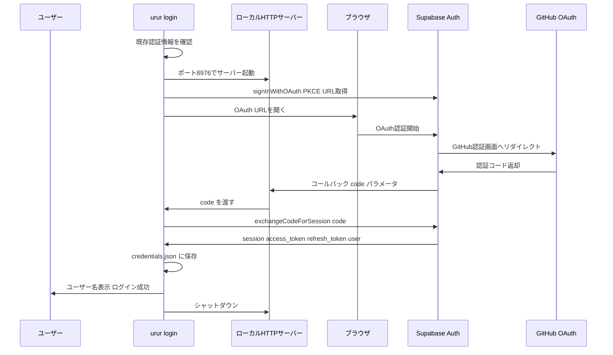

# Design Document: login-command

## Overview

**Purpose**: `urur login` コマンドで GitHub OAuth 認証を行い、Supabase のセッショントークンをローカルに保存する。CLI ユーザーが以降のコマンド（submit, whoami）で認証済み状態を利用できるようにする。

**Users**: CLI 利用者が `urur login` を実行し、ブラウザで GitHub 認証後、自動的にトークンが保存される。

### Goals
- Supabase PKCE フローによる安全な OAuth 認証
- ローカル HTTP サーバーでコールバックを受信し、トークンを `~/.urur/credentials.json` に保存
- 認証状態の確認・再ログイン・エラーハンドリングを含む完全なフロー

### Non-Goals
- トークンのリフレッシュ（他コマンド実行時に別途対応）
- 複数の OAuth プロバイダー対応（GitHub のみ）
- GUI やブラウザ内の認証完了画面のカスタマイズ

## Architecture

### Existing Architecture Analysis

既存コンポーネント:
- `src/lib/auth.ts` — `Credentials` 型、`loadCredentials()`, `saveCredentials()`, `clearCredentials()` 実装済み
- `src/lib/supabase.ts` — `getSupabaseClient()` 実装済み（ストレージアダプター未対応）
- `src/lib/config.ts` — `SUPABASE_URL`, `SUPABASE_ANON_KEY` をビルド時定数で提供
- `src/commands/login.ts` — スタブ（`LoginOptions { port: string }` 定義済み）

### Architecture Pattern & Boundary Map



**Architecture Integration**:
- **Selected pattern**: コマンドハンドラ + OAuth ヘルパー分離。`login.ts` がオーケストレーション、`src/lib/` が共通ロジック
- **Existing patterns preserved**: 1コマンド1ファイル、共通処理は `src/lib/` に委譲
- **New components**: `src/lib/oauthServer.ts`（ローカル HTTP サーバー管理）
- **Steering compliance**: `node:http` 標準ライブラリのみ使用、外部依存追加なし

### Technology Stack

| Layer | Choice / Version | Role | Notes |
|-------|-----------------|------|-------|
| CLI | Commander.js | `--port` オプション処理 | 既存定義済み |
| Auth | @supabase/supabase-js v2.49 | PKCE OAuth フロー | `signInWithOAuth` + `exchangeCodeForSession` |
| HTTP Server | node:http | OAuth コールバック受信 | 標準ライブラリ、依存追加なし |
| Browser | open | ブラウザ自動オープン | 既存依存 |
| UX | ora + picocolors | スピナー・色付きメッセージ | 既存依存 |
| Prompt | @inquirer/prompts | 再ログイン確認 | 既存依存 |

## Requirements Traceability

| Requirement | Summary | Components |
|-------------|---------|------------|
| 1.1, 1.2 | サーバー起動（デフォルト/カスタムポート） | `oauthServer.ts`, `login.ts` |
| 1.3 | ブラウザで OAuth URL を開く | `login.ts`, `supabase.ts` |
| 1.4 | スピナー表示 | `login.ts` |
| 2.1 | トークン保存 | `login.ts`, `auth.ts` |
| 2.2 | サーバーシャットダウン | `oauthServer.ts` |
| 2.3 | ユーザー名表示 | `login.ts` |
| 2.4 | 成功メッセージ・正常終了 | `login.ts` |
| 3.1 | ポート使用中エラー | `oauthServer.ts` |
| 3.2 | コールバックエラー | `oauthServer.ts`, `login.ts` |
| 3.3 | タイムアウト | `oauthServer.ts` |
| 4.1, 4.2 | 既存ログイン状態確認・表示 | `login.ts`, `auth.ts` |
| 4.3, 4.4 | 再ログイン確認プロンプト | `login.ts` |
| 5.1, 5.2, 5.3 | テスト | `tests/commands/login.test.ts` |

## Components and Interfaces

| Component | Domain | Intent | Req Coverage | Key Dependencies |
|-----------|--------|--------|--------------|------------------|
| `src/commands/login.ts` | Command | loginコマンドのオーケストレーション | 1.3, 1.4, 2.1-2.4, 4.1-4.4 | auth.ts, oauthServer.ts, supabase.ts |
| `src/lib/oauthServer.ts` | Infra | ローカルHTTPサーバーの起動・コールバック受信・シャットダウン | 1.1, 1.2, 2.2, 3.1, 3.2, 3.3 | node:http |
| `src/lib/supabase.ts` | Auth | Supabaseクライアント（PKCE対応）| 1.3, 2.1 | @supabase/supabase-js |
| `tests/commands/login.test.ts` | Test | ユニットテスト | 5.1-5.4 | vitest |

### Infra Layer

#### `src/lib/oauthServer.ts`

| Field | Detail |
|-------|--------|
| Intent | OAuth コールバックを受信するローカル HTTP サーバーの管理 |
| Requirements | 1.1, 1.2, 2.2, 3.1, 3.2, 3.3 |

**Responsibilities & Constraints**
- 指定ポートで `node:http` サーバーを起動
- `/callback?code=xxx` リクエストを受信して code を返す
- タイムアウト（60秒）管理
- サーバーの確実なシャットダウン

**Dependencies**
- External: `node:http` — HTTPサーバー (P0)

**Contracts**: Service [x]

##### Service Interface
```typescript
interface OAuthCallbackResult {
  code: string
}

interface OAuthServerError {
  type: 'PORT_IN_USE' | 'TIMEOUT' | 'CALLBACK_ERROR'
  message: string
}

interface OAuthServer {
  /** サーバーを起動し、コールバックを待機。成功時にcodeを返す */
  waitForCallback(port: number, timeoutMs: number): Promise<OAuthCallbackResult>
  /** サーバーをシャットダウン */
  close(): void
}
```
- Preconditions: ポートが利用可能であること
- Postconditions: code を返した後、またはエラー/タイムアウト後にサーバーが閉じられる

**Implementation Notes**
- `server.listen()` の `EADDRINUSE` エラーを検出して `PORT_IN_USE` エラーとして返す
- コールバック URL に `error` パラメータがある場合は `CALLBACK_ERROR` として処理
- コールバック受信後、ブラウザに「認証完了。ターミナルに戻ってください」の HTML レスポンスを返す

### Auth Layer

#### `src/lib/supabase.ts` — 拡張

| Field | Detail |
|-------|--------|
| Intent | PKCE フロー対応の Supabase クライアント提供 |
| Requirements | 1.3, 2.1 |

**拡張内容**:
- `getSupabaseClient()` にインメモリ storage adapter を追加（PKCE の code_verifier 保持用）
- `auth.flowType: 'pkce'` を設定

```typescript
/** インメモリストレージアダプター（PKCE code_verifier 用） */
function createMemoryStorage(): {
  getItem(key: string): string | null
  setItem(key: string, value: string): void
  removeItem(key: string): void
}

/** PKCE対応の Supabase クライアントを生成 */
function getSupabaseClient(): SupabaseClient
```

### Command Layer

#### `src/commands/login.ts`

| Field | Detail |
|-------|--------|
| Intent | login コマンドのオーケストレーション（認証フロー全体の制御） |
| Requirements | 1.3, 1.4, 2.1-2.4, 4.1-4.4 |

**フロー**:
1. `loadCredentials()` で既存認証を確認
2. 既存認証あり → ユーザー名表示 + 再ログイン確認プロンプト
3. `signInWithOAuth({ skipBrowserRedirect: true })` で OAuth URL 取得
4. `oauthServer.waitForCallback(port, 60000)` でサーバー起動
5. `open(url)` でブラウザオープン + スピナー表示
6. コールバック受信 → `exchangeCodeForSession(code)` でセッション取得
7. `saveCredentials({ access_token, refresh_token, expires_at })` で保存
8. ユーザー名表示 + 成功メッセージ

**Dependencies**
- Inbound: `program.ts` — Commander.js action (P0)
- Outbound: `auth.ts` — 認証情報の読み書き (P0)
- Outbound: `oauthServer.ts` — コールバックサーバー (P0)
- Outbound: `supabase.ts` — Supabase クライアント (P0)
- External: `open` — ブラウザオープン (P1)
- External: `ora` — スピナー (P2)
- External: `@inquirer/prompts` — 再ログイン確認 (P1)

## Error Handling

### Error Categories

| エラー | 種別 | 対応 |
|--------|------|------|
| ポート使用中 (`EADDRINUSE`) | インフラ | エラーメッセージ表示、`--port` で別ポート指定を案内 |
| OAuthコールバックエラー | 認証 | エラー内容表示、再試行を案内 |
| タイムアウト（60秒） | インフラ | タイムアウトメッセージ表示、サーバーシャットダウン |
| ネットワークエラー | インフラ | エラーメッセージ表示 |

すべてのエラーケースで:
- picocolors で赤色エラーメッセージ表示
- スピナーを停止
- ローカルサーバーを確実にシャットダウン
- `process.exitCode = 1` を設定

## Testing Strategy

### Unit Tests (`tests/commands/login.test.ts`)
- `oauthServer.ts`: コールバック受信・タイムアウト・ポート競合のテスト
- `login.ts`: 既存認証状態の判定ロジック（モック使用）
- `supabase.ts`: PKCE 対応クライアントの生成確認

### Integration Notes
- `open`, `ora`, `@inquirer/prompts` はモックで置き換え
- `node:http` サーバーは実際に起動してテスト（localhost のみ）
- Supabase API 呼び出しはモック
