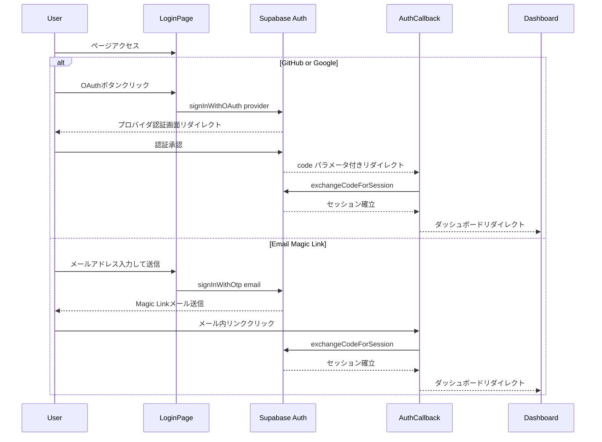

# Design Document: multi-provider-login

## Overview

**Purpose**: ログインページに GitHub / Google / Email Magic Link の3つの認証プロバイダを提供し、ユーザーの参加障壁を下げる。
**Users**: 個人開発者（GitHub ユーザー、Google ユーザー、メールのみのユーザー）がサービスへの参加に利用する。
**Impact**: 既存の `web/app/routes/login.tsx` を刷新し、コピーとボタン構成を変更する。`auth/callback.tsx` は変更しない。

### Goals
- GitHub に加え Google OAuth と Email Magic Link を提供し、ユーザーの選択肢を拡大する
- キャッチコピーを「個人開発を世界へ」に変更し、サービスのビジョンを訴求する
- 既存の認証コールバックロジックとの互換性を維持する

### Non-Goals
- パスワード認証の実装
- 認証コールバック (`auth/callback.tsx`) の変更
- Supabase ダッシュボードの自動設定（手動設定前提）
- ユーザープロフィール統合（同一メールでの GitHub/Google/Email アカウントリンク）

## Architecture

### Existing Architecture Analysis

現在のログインページは以下の構成:
- **サーバーサイド**: HonoX の `createRoute` でルーティング。ユーザーセッション確認、エラー/メッセージパラメータ処理、JSX レンダリング
- **クライアントサイド**: `dangerouslySetInnerHTML` の inline script で Supabase JS クライアントを初期化し、OAuth フローを実行
- **認証コールバック**: `auth/callback.tsx` で PKCE code exchange + implicit flow フォールバック

この構成を維持し、login.tsx 内で拡張する。

### Architecture Pattern & Boundary Map



**Architecture Integration**:
- Selected pattern: 既存の SSR + クライアントサイド inline script パターンを維持
- Domain boundaries: login.tsx 内で完結（UI + クライアント認証ロジック）
- Existing patterns preserved: `createRoute`, `dangerouslySetInnerHTML`, Supabase CDN ロード
- New components rationale: 新コンポーネント不要。既存ファイル内でボタンとスクリプトを追加

### Technology Stack

| Layer | Choice / Version | Role in Feature | Notes |
|-------|------------------|-----------------|-------|
| Frontend | HonoX + JSX | SSR ログインページレンダリング | 既存 |
| Auth Client | @supabase/supabase-js v2 (CDN) | OAuth / OTP 認証実行 | 既存。`signInWithOAuth`, `signInWithOtp` を使用 |
| Auth Server | Supabase Auth | プロバイダ認証 + セッション管理 | Google / Email provider の有効化が必要 |

## Requirements Traceability

| Requirement | Summary | Components | Flows |
|-------------|---------|------------|-------|
| 1.1, 1.2, 1.3 | ページコピー変更 | LoginPageHeader | — |
| 2.1, 2.2, 2.3, 2.4 | GitHub OAuth | OAuthButtonGroup, OAuthHandler | OAuth Flow |
| 3.1, 3.2, 3.3, 3.4 | Google OAuth | OAuthButtonGroup, OAuthHandler | OAuth Flow |
| 4.1, 4.2, 4.3, 4.4, 4.5, 4.6 | Email Magic Link | EmailToggleButton, EmailForm, MagicLinkHandler | Magic Link Flow |
| 5.1, 5.2, 5.3, 5.4, 5.5 | UI レイアウト | OAuthButtonGroup, Divider, EmailToggleButton | — |
| 6.1, 6.2, 6.3 | エラーハンドリング | ErrorMessages, ErrorDisplay | — |
| 7.1, 7.2, 7.3, 7.4 | コールバック互換性 | AuthCallback (変更なし) | OAuth / Magic Link Flow |

## Components and Interfaces

全コンポーネントは `web/app/routes/login.tsx` 内の JSX セクションとして実装される（HonoX の SSR パターンに従い、個別ファイル分割は行わない）。

| Component | Domain | Intent | Req Coverage | Key Dependencies | Contracts |
|-----------|--------|--------|--------------|------------------|-----------|
| LoginPageHeader | UI | キャッチコピーとロゴ表示 | 1.1, 1.2, 1.3 | なし | — |
| OAuthButtonGroup | UI | GitHub/Google ボタン表示 | 2.1, 3.1, 5.1, 5.2, 5.5 | — | — |
| Divider | UI | 「または」区切り線 | 5.4 | — | — |
| EmailToggleButton | UI | メールボタン + フォーム展開 | 4.1, 4.2, 5.3 | — | — |
| EmailForm | UI | メール入力 + 送信ボタン + メッセージ | 4.3, 4.4, 4.5, 4.6 | Supabase Client (P0) | State |
| ErrorMessages | Data | エラーコード → メッセージマッピング | 6.1, 6.2 | — | — |
| ErrorDisplay | UI | エラーメッセージ表示領域 | 6.3 | — | — |
| OAuthHandler | Logic | OAuth 認証フロー制御 | 2.2, 2.3, 2.4, 3.2, 3.3, 3.4 | Supabase Client (P0) | Service |
| MagicLinkHandler | Logic | Magic Link 送信フロー制御 | 4.3, 4.4, 4.5, 4.6 | Supabase Client (P0) | Service |

### Logic Layer

#### OAuthHandler

| Field | Detail |
|-------|--------|
| Intent | GitHub / Google OAuth フローの開始とローディング状態管理 |
| Requirements | 2.2, 2.3, 2.4, 3.2, 3.3, 3.4 |

**Responsibilities & Constraints**
- provider 名を引数に受け取り、共通の OAuth フローを実行する
- ボタンのローディング状態（無効化 + スピナー）を管理する
- エラー時にボタンを元の状態に復帰させる

**Dependencies**
- External: Supabase JS Client — `signInWithOAuth` (P0)

**Contracts**: Service [x]

##### Service Interface
```typescript
// inline script 内の関数（TypeScript 型は設計時の参考）
interface OAuthHandlerContract {
  handleOAuth(provider: 'github' | 'google'): Promise<void>
  setButtonLoading(button: HTMLButtonElement, loading: boolean): void
}
```
- Preconditions: Supabase クライアントが初期化済み、ボタン要素が DOM に存在する
- Postconditions: 成功時 → プロバイダ認証画面にリダイレクト、失敗時 → alert 表示 + ボタン復帰

#### MagicLinkHandler

| Field | Detail |
|-------|--------|
| Intent | Email Magic Link の送信と結果メッセージの表示 |
| Requirements | 4.3, 4.4, 4.5, 4.6 |

**Responsibilities & Constraints**
- メールアドレスの空チェック（クライアントサイドバリデーション）
- `signInWithOtp` の実行と結果ハンドリング
- 成功/エラーメッセージの表示と送信ボタンの状態管理

**Dependencies**
- External: Supabase JS Client — `signInWithOtp` (P0)

**Contracts**: Service [x] / State [x]

##### Service Interface
```typescript
// inline script 内の関数（TypeScript 型は設計時の参考）
interface MagicLinkHandlerContract {
  handleEmailSubmit(): Promise<void>
}
```
- Preconditions: email-input 要素に値が入力済み、Supabase クライアント初期化済み
- Postconditions: 成功時 → 成功メッセージ表示 + ボタン「送信済み」、失敗時 → エラーメッセージ表示 + ボタン復帰

##### State Management
- `emailForm.style.display`: `'none'` | `'block'` — メールフォームのトグル状態
- `emailMessage`: 成功/エラーメッセージの表示・色・テキスト
- `emailSubmitBtn`: disabled / opacity / textContent の状態遷移

### Data Layer

#### ErrorMessages

| Field | Detail |
|-------|--------|
| Intent | エラーコードからユーザー向けメッセージへの変換 |
| Requirements | 6.1, 6.2 |

**定義**:
```typescript
const errorMessages: Record<string, string> = {
  access_denied: '認証がキャンセルされました',           // プロバイダ非依存
  no_code: '認証コードが見つかりませんでした',
  profile_creation_failed: 'プロフィールの作成に失敗しました。管理者にお問い合わせください。',
  default: '認証中にエラーが発生しました。もう一度お試しください',
}
```

**Implementation Notes**
- `access_denied` は GitHub 固有の表現を削除し、全プロバイダ共通の文言に変更
- 不明なエラーコードは `decodeURIComponent` でデコードして表示、フォールバックは `default`

## Error Handling

### Error Strategy
クライアントサイドの try-catch でエラーを捕捉し、ユーザーに即座にフィードバックする。

### Error Categories and Responses

| カテゴリ | トリガー | レスポンス |
|---------|---------|-----------|
| OAuth 開始失敗 | `signInWithOAuth` エラー | `alert()` + ボタン復帰 |
| Magic Link 送信失敗 | `signInWithOtp` エラー | `email-message` にエラー表示 + ボタン復帰 |
| メール未入力 | 空文字列で送信 | `email-message` にバリデーションエラー |
| コールバックエラー | `error` クエリパラメータ | `errorMessages` マッピングで赤枠表示 |
| 認証キャンセル | `access_denied` | 「認証がキャンセルされました」表示 |

## Testing Strategy

### 手動テスト（E2E）
本機能は Web ページの SSR + クライアントサイド JS で構成されるため、主に手動 E2E テストで検証する。

1. **GitHub OAuth フロー**: ボタンクリック → GitHub 認証 → ダッシュボードリダイレクト
2. **Google OAuth フロー**: ボタンクリック → Google 認証 → ダッシュボードリダイレクト
3. **Email Magic Link フロー**: メール入力 → 送信 → メール受信 → リンククリック → ダッシュボード
4. **エラーハンドリング**: 認証キャンセル時のメッセージ表示
5. **UI 表示**: ボタン順序、スタイル、区切り線の視覚確認

### ユニットテスト対象外
- inline script 内のロジックは Vitest でのテストが困難なため、手動テストで代替
- `errorMessages` の静的定義は変更頻度が低く、手動確認で十分

## Security Considerations

- OAuth フローは Supabase の PKCE フローを使用（推奨されるセキュアな方式）
- Magic Link は `emailRedirectTo` に `origin + '/auth/callback'` を指定し、オープンリダイレクトを防止
- Supabase ANON KEY はクライアントサイドで公開される設計（RLS ポリシーで保護）
- CSRF 保護は Supabase Auth の組み込み機能に依存
