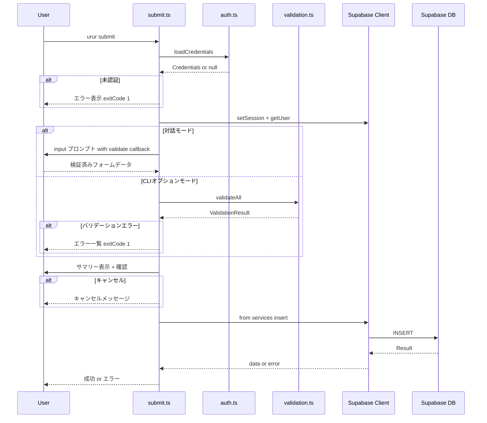

# Technical Design: submit-command

## Overview

**Purpose**: `urur submit` コマンドにより、CLIユーザーがターミナルからサービス情報を urur.dev に投稿できるようにする。

**Users**: 個人開発者がターミナルから素早くサービスを登録する。対話モードとCLIオプションの両方をサポートし、投稿前にバリデーションと確認を行う。

**Impact**: 既存の submit.ts スタブを完全実装に置き換える。他ファイルへの変更はない。

### Goals
- 認証済みユーザーがCLIからサービスを投稿できる
- 対話モードとCLIオプションの両方をサポートする
- 投稿前にバリデーションと確認フローを提供する

### Non-Goals
- カテゴリ選択（将来対応）
- 投稿後の編集・削除
- 画像アップロード（logo_url は URL 指定のみ）

## Architecture

### Existing Architecture Analysis

現在の submit.ts はスタブのみ。以下の既存パターンを踏襲する:

- **認証パターン**: `loadCredentials()` → `setSession()` → `getUser()`（login.ts で確立）
- **エラーハンドリング**: `process.exitCode = 1` + `pc.red()` メッセージ
- **UXパターン**: `ora` スピナー、`@inquirer/prompts` プロンプト、`picocolors` 色付き出力
- **テストパターン**: `vi.mock()` で全依存をモック、`vi.mocked()` で型安全アクセス

### Architecture Pattern & Boundary Map



**Architecture Integration**:
- Selected pattern: 単一コマンドファイル拡張（既存パターン踏襲）
- Domain boundaries: submit.ts はオーケストレーションのみ。認証・バリデーション・DB操作は既存モジュールに委譲
- Existing patterns preserved: login.ts の認証チェック、エラーハンドリング、スピナーパターン
- New components rationale: 新規コンポーネントなし。submit.ts の中身を実装するのみ

### Technology Stack

| Layer | Choice / Version | Role in Feature | Notes |
|-------|------------------|-----------------|-------|
| CLI | Commander.js | オプション解析（登録済み） | 変更なし |
| Prompts | @inquirer/prompts v7.2.1 | 対話モード入力 | `input`, `confirm` を使用 |
| Auth | src/lib/auth.ts | 認証情報読み込み | 既存利用 |
| Validation | src/lib/validation.ts | 入力バリデーション | 既存利用 |
| Data | @supabase/supabase-js v2.49.1 | DB INSERT | 初のdata操作 |
| UX | ora, picocolors | スピナー・色付き出力 | 既存パターン |

## Requirements Traceability

| Requirement | Summary | Components | Interfaces | Flows |
|-------------|---------|------------|------------|-------|
| 1.1 | credentials読み込み・セッション設定 | SubmitCommand | loadCredentials, setSession | 認証チェック |
| 1.2 | 未認証エラー表示 | SubmitCommand | — | 認証チェック |
| 1.3 | 無効認証エラー表示 | SubmitCommand | getUser | 認証チェック |
| 2.1 | 対話プロンプトで入力 | SubmitCommand | promptServiceData | 対話モード |
| 2.2 | 必須未指定時フォールバック | SubmitCommand | shouldUseInteractive | 入力判定 |
| 2.3 | 必須/任意フィールド区分 | SubmitCommand | promptServiceData | 対話モード |
| 3.1 | CLIオプションで非対話実行 | SubmitCommand | SubmitOptions | CLIオプション |
| 3.2 | オプショナルフィールド | SubmitCommand | SubmitOptions | CLIオプション |
| 4.1 | validateAll で検証 | SubmitCommand | validateAll | バリデーション |
| 4.2 | エラー一覧表示 | SubmitCommand | displayErrors | バリデーション |
| 4.3 | バリデーション後のみ投稿 | SubmitCommand | — | フロー制御 |
| 5.1 | services テーブルINSERT | SubmitCommand | insertService | DB INSERT |
| 5.2 | 成功メッセージ表示 | SubmitCommand | — | 結果表示 |
| 5.3 | 投稿失敗エラー表示 | SubmitCommand | — | エラーハンドリング |
| 5.4 | スピナー表示 | SubmitCommand | ora | UX |
| 6.1 | サマリー＋確認プロンプト | SubmitCommand | displaySummary, confirm | 投稿前確認 |
| 6.2 | キャンセル処理 | SubmitCommand | — | 投稿前確認 |

## Components and Interfaces

| Component | Domain/Layer | Intent | Req Coverage | Key Dependencies | Contracts |
|-----------|-------------|--------|-------------|-----------------|-----------|
| SubmitCommand | Commands | サービス投稿のオーケストレーション | 1.1–6.2 | auth (P0), supabase (P0), validation (P0), inquirer (P1) | Service |

### Commands Layer

#### SubmitCommand

| Field | Detail |
|-------|--------|
| Intent | CLIからのサービス投稿フローをオーケストレーションする |
| Requirements | 1.1, 1.2, 1.3, 2.1, 2.2, 2.3, 3.1, 3.2, 4.1, 4.2, 4.3, 5.1, 5.2, 5.3, 5.4, 6.1, 6.2 |

**Responsibilities & Constraints**
- 認証チェック → 入力収集 → バリデーション → 確認 → 投稿の一連のフローを制御
- 認証・バリデーション・DB操作は既存モジュールに委譲
- コマンド固有のロジック（対話プロンプト、サマリー表示）のみ含む

**Dependencies**
- Inbound: Commander.js — CLIオプション受け渡し (P0)
- Outbound: auth.ts/loadCredentials — 認証情報取得 (P0)
- Outbound: supabase.ts/getSupabaseClient — DBクライアント取得 (P0)
- Outbound: validation.ts/validateAll — 入力検証 (P0)
- External: @inquirer/prompts — 対話入力 (P1)
- External: ora — スピナー表示 (P2)

**Contracts**: Service [x]

##### Service Interface

```typescript
interface SubmitOptions {
  name?: string
  url?: string
  tagline?: string
  description?: string
  logoUrl?: string
  interactive?: boolean
}

// メインエントリポイント（Commander.js から呼び出し）
function submit(options: SubmitOptions): Promise<void>
```

内部ヘルパー関数（export しない）:

```typescript
// 対話モード判定
function shouldUseInteractive(options: SubmitOptions): boolean
// 戻り値: options.interactive === true || !options.name || !options.url

// 対話プロンプトでデータ収集（即時バリデーション付き）
function promptServiceData(): Promise<ServiceFormData>
// input({ message, validate: validateName }) で name を必須入力（即時検証）
// input({ message, validate: validateUrl }) で url を必須入力（即時検証）
// input({ message, validate: validateTagline }) で tagline を任意入力
// input({ message, validate: validateDescription }) で description を任意入力
// input({ message, validate: validateLogoUrl }) で logo_url を任意入力
// 戻り値: ServiceFormData（各フィールドは検証済み）

// サマリー表示
function displaySummary(data: ServiceFormData): void
// console.log でフィールド一覧を表示

// バリデーションエラー表示
function displayErrors(errors: Record<string, string>): void
// 各フィールドのエラーを赤字で表示
```

- Preconditions: Commander.js がオプションをパースして SubmitOptions を渡す
- Postconditions: 成功時は services テーブルにレコードが追加される。失敗時は process.exitCode = 1
- Invariants: 認証済みかつバリデーション通過後にのみ DB INSERT を実行する

**Implementation Notes**
- 認証チェック: login.ts の `loadCredentials()` → `setSession()` → `getUser()` パターンを適用
- バリデーション戦略（モード別）:
  - **対話モード**: `input({ validate })` で即時バリデーションを適用し、エラー時は再入力を促す。個別バリデータ（`validateName`, `validateUrl` 等）を validate コールバックに渡す。`validateAll()` は呼ばない（各プロンプトで検証済みのため）
  - **CLIオプションモード**: `validateAll()` で一括検証。エラーがあれば `displayErrors()` で一覧表示し exitCode 1 で終了
- DB INSERT: `supabase.from('services').insert({ user_id, name, url, source: 'cli', ... }).select().single()` を使用。`user_id` は `getUser()` から取得。`source: 'cli'` を明示的に設定
- スピナー: INSERT 処理中のみ表示（`ora('投稿中...').start()`）
- リスク: RLS ポリシーによる INSERT 拒否時のエラーメッセージが不明瞭になる可能性 → Supabase error.message をそのまま表示

## Data Models

### Domain Model

既存の `services` テーブルに `source` カラムを追加。Web/CLI からの投稿を区別する。

- **ServiceInsert**（INSERT用）: `user_id` (必須), `name` (必須), `url` (必須), `tagline`, `description`, `logo_url`, `status`, `source`
- **status**: CLI から指定しない（DB デフォルトまたは RLS ポリシーに委譲）
- **source**: CLI からは `'cli'` を明示的に指定。DB デフォルトは `'web'`

### Data Contracts

```typescript
// INSERT時に構築するデータ
interface ServiceInsertPayload {
  user_id: string        // getUser() から取得
  name: string           // 必須
  url: string            // 必須
  tagline?: string       // 任意
  description?: string   // 任意
  logo_url?: string      // 任意
  source: 'cli'          // CLI投稿を明示
}
// status は指定しない（サーバーサイドデフォルト）
```

## Error Handling

### Error Categories and Responses

| カテゴリ | トリガー | レスポンス | exitCode |
|---------|---------|-----------|----------|
| 未認証 | credentials が null | 「ログインが必要です。`urur login` を実行してください。」 | 1 |
| セッション無効 | getUser() エラー | 「認証エラー: {message}。`urur login` で再ログインしてください。」 | 1 |
| バリデーション | validateAll() エラー | 各フィールドのエラーメッセージを一覧表示 | 1 |
| DB INSERT失敗 | insert() エラー | 「投稿エラー: {message}」 | 1 |
| ユーザーキャンセル | confirm() で No | 「投稿をキャンセルしました。」 | 0（正常終了） |

## Testing Strategy

### Unit Tests（TDD必須）
1. 未認証時にエラーメッセージを表示し exitCode 1 で終了する
2. セッション設定失敗時にエラーメッセージを表示し exitCode 1 で終了する
3. 対話モード判定: `-i` フラグ、name/url 未指定時のフォールバック
4. バリデーションエラー時にエラー一覧を表示し exitCode 1 で終了する
5. 確認プロンプトで No 選択時にキャンセルする

### Integration Tests
1. CLIオプション指定 → バリデーション → 確認 → INSERT 成功フロー
2. 対話モード → 入力 → バリデーション → 確認 → INSERT 成功フロー
3. INSERT 失敗時のエラーハンドリング

### テストパターン
- login.test.ts のモックパターンを踏襲
- `vi.mock()` で auth, supabase, @inquirer/prompts, ora をモック
- `vi.spyOn(console, 'log')` で出力検証
- `process.exitCode` でエラー終了検証
